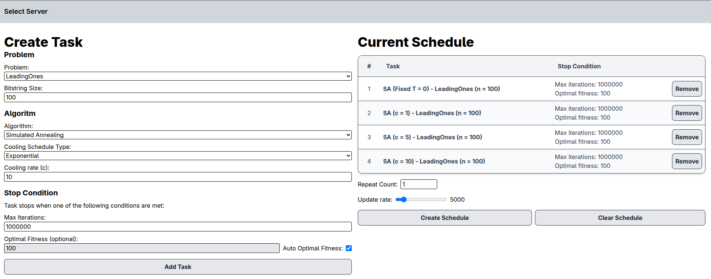

# Glorious Evolutionary Algorithm Simulator

**Bachelor project title:**
Visualizing and Evaluating the Working Principles of Nature-inspired Optimization Metaheuristics

**Group members:**
- Mads Christian Wrang Nielsen (s224784)
- Frederik Hvarregaard Andersen (s224801)

# Running the project
The project consists of both a server running the simulations, written in **rust**,
and a web-based client written in **TypeScript** using **Svelte 5**.

Running the server:
```shell
$ cd ./server
$ cargo run --bin server --release
```
This will build and start the server running at port 3000.

The web-client is fully client-side and therefore can be built and served
by any webserver, or packaged in something like Electron.
During development we've used `npm` to serve the client frontend:
```shell
$ cd ./client
$ npm run dev
```
This will serve the frontend at `http://localhost:5173/`

When opening the frontend you're prompted to enter the URL of the server
(defaulted to `http://localhost:3000`). Upen entering the URL of a running server
you're presented with the interface to create a simulation schedule to be run on the selected server.


